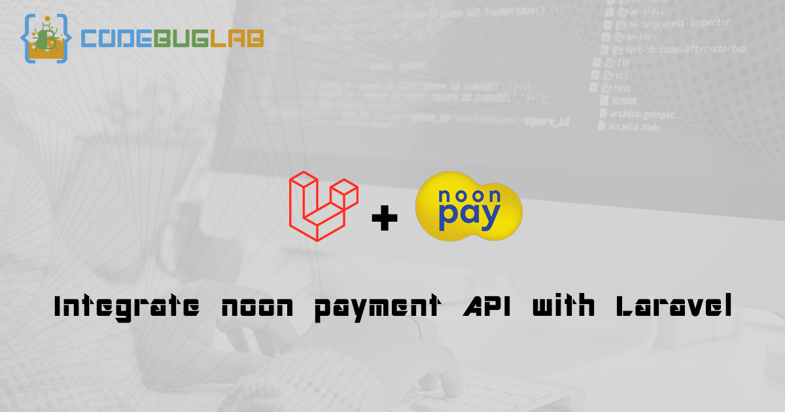

# ⚡⚡⚡ Noon Payment with Laravel

Integrate [NoonPayment](https://www.noonpayments.com/) API with Laravel

[](https://github.com/codebuglab/noon-payment-laravel/issues)
[](https://github.com/codebuglab/noon-payment-laravel/network/members)
[](https://github.com/codebuglab/noon-payment-laravel/stargazers)
[](https://packagist.org/packages/codebuglab/noon-payment-laravel)



## Table of contents <!-- omit in toc -->

- [⚡⚡⚡ Noon Payment with Laravel](#-noon-payment-with-laravel)
  - [Setup](#setup)
    - [Installation](#installation)
    - [Config](#config)
  - [Publish (optional)](#publish-optional)
  - [Routes (optional)](#routes-optional)
  - [Test Card](#test-card)
  - [Available API Methods](#available-api-methods)
    - [Initiate](#initiate)
    - [Get Order](#get-order)
  - [Notices](#notices)
  - [License](#license)

## Setup
### Installation

To install this package through composer run the following command in the terminal

```bash
composer require codebuglab/noon-payment-laravel
```

### Config

Refer to [Noon docs](https://docs.noonpayments.com/start/authorization) to get your info then add them to `.env` file

```text
NOON_PAYMENT_BUSINESS_ID=
NOON_PAYMENT_APP_NAME=
NOON_PAYMENT_APP_KEY=
NOON_PAYMENT_TOKEN_IDENTIFIER=
NOON_PAYMENT_RETURN_URL=http://127.0.0.1:8000/noon_payment_response
# Change the mode to Live for the Production or set it as Test
NOON_PAYMENT_MODE=Test
# Pre-configured order route categories (the categories will be mentioned also in the initial setup email)
NOON_PAYMENT_ORDER_CATEGORY=
# Channels are pre-defined and limited to Web / Mobile (the channels will be mentioned also in the initial setup email)
NOON_PAYMENT_CHANNEL=web
# Default value - Payment API Endpoint - Chooses
# https://api.noonpayments.com/payment/v1/
# https://api-test.noonpayments.com/payment/v1/
NOON_PAYMENT_PAYMENT_API=https://api-test.noonpayments.com/payment/v1/

```

## Publish (optional)

Run this command in terminal to publish package files in your app

```php
php artisan vendor:publish --provider="CodeBugLab\NoonPayment\NoonPaymentServiceProvider"
```

This will publish 2 files

```php
1- App/Http/Controllers/NoonPaymentController.php
2- config/noon_payment.php
```

- Feel free to change `noon_payment.php` config file and set package configuration on this file instead of `.env` if you want
- If you don't need the config file you can run this command instead

```php
php artisan vendor:publish --provider="CodeBugLab\NoonPayment\NoonPaymentServiceProvider" --tag=controller
```

- `NoonPaymentController.php` is a simple example to use it in your project, consider it as a demo.

## Routes (optional)
This package has two routes using `NoonPaymentController.php` file

- Create payment page:
```txt
http://yourwebsite/noon_payment
```
Which call function ( `NoonPaymentController@index` ) by `GET` Request
- Receiving response
```txt
http://yourwebsite/noon_payment_response
```

Which receive a `GET` response through function ( `NoonPaymentController@response` )

## Test Card
the link for test cards by official documentation => [Test Cards](https://docs.noonpayments.com/test/cards)

## Available API Methods
### Initiate
- This will initiate new order.
```php
$data =[
    "order" => [
        "reference" => "1",
        "amount" => "10",
        "currency" => "SAR",
        "name" => "Sample order name",
    ],
    "configuration" => [
        "locale" => "en"
     ]
]
$response = NoonPayment::getInstance()->initiate($data);
```
- Simply you can use response and redirect to pay page through this code
```php
if ($response->resultCode == 0) {
    return redirect($response->result->checkoutData->postUrl);
}
```
- After sitting your payment information or cancel the process you will go to response page
- Remember you set it up earlier in `.env` file like this
```txt
NOON_PAYMENT_RETURN_URL=http://127.0.0.1:8000/noon_payment_response
```
- For more information about request and response for initiate visit documentation ( [Payment Initiate](https://docs.noonpayments.com/payment-api/reference/initiate) )

### Get Order
- This will get your order information by order id that retrieved by initiate function
```php
 $response = NoonPayment::getInstance()->getOrder($orderId);
```
- Simply you can check if transaction is success by using `$response` variable like this
```php
if (
    $response->result->transactions[0]->type == "SALE" &&
    $response->result->transactions[0]->status == "SUCCESS"
) {
    //success Message
}
```
- For more information about response and request for initiate visit documentation ( [Payment Get Order](https://docs.noonpayments.com/payment-api/reference/get-order) )


## Notices

- If you facing any problems using this package try use [Publish](#publish) and [Routes](#routes) this will give you a simple example in `NoonPaymentController.php` file.
- If you want to make `Refund` or `Cancel` for order then this package doesn't provide these methods yet, So we highly recommend to read full [Documentation](https://docs.noonpayments.com/start/introduction) before try this and making a pull request.

## License

This package is a free software distributed under the terms of the MIT license.
